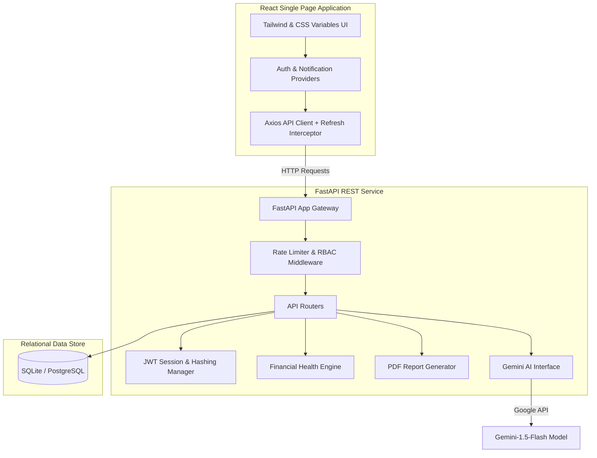
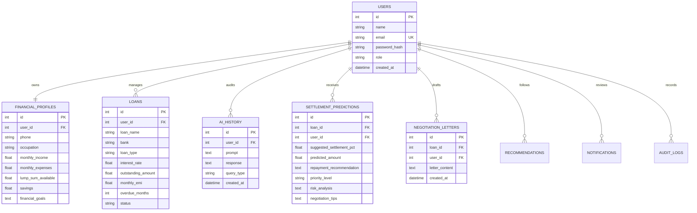

# FinRelief AI – AI Powered Debt Relief & Financial Recovery Platform

FinRelief AI is an enterprise-grade, full-stack application designed to help borrowers manage debt profiles, compute stress metrics, leverage Google Gemini AI for one-time settlements and strategic planning, draft legal settlement proposals, and consult financial advisor agents.

---

## 🏛️ System Architecture



---

## 📊 Relational Database Schema (ERD)



---

## 🚀 Installation & Local Setup

### Prerequisite Environment
- Python 3.11+
- Node.js 18+ (for local frontend installation, optional if running Docker)

### 1. Backend Setup
1. Navigate to the backend directory:
   ```bash
   cd backend
   ```
2. Create and activate a Python virtual environment:
   ```bash
   python -m venv venv
   # On Windows:
   venv\Scripts\activate
   # On macOS/Linux:
   source venv/bin/activate
   ```
3. Install dependencies:
   ```bash
   pip install -r requirements.txt
   ```
4. Define environment variables in a `.env` file:
   ```env
   SECRET_KEY=supersecretkeyforfinreliefai123access
   REFRESH_SECRET_KEY=supersecretkeyforfinreliefai123refresh
   DATABASE_URL=sqlite:///./finrelief.db
   GEMINI_API_KEY=your_gemini_api_key_here
   ```
5. Run the server from the root directory:
   ```bash
   python run.py
   ```
   Or from the backend directory:
   ```bash
   uvicorn app.main:app --reload
   ```
   API Docs will be available at `http://127.0.0.1:8000/docs`.

### 2. Frontend Setup
1. Navigate to the frontend directory:
   ```bash
   cd frontend
   ```
2. Install dependencies:
   ```bash
   npm install
   ```
3. Run the development server:
   ```bash
   npm run dev
   ```
   Open `http://localhost:5173` in your browser.

---

## 🐳 Docker Deployment

To launch the complete application stack (React frontend, FastAPI backend, and a production PostgreSQL database), run:
```bash
docker-compose up --build
```
- **Frontend URL**: `http://localhost`
- **Backend API URL**: `http://localhost/api`
- **PostgreSQL Database**: Port `5432`

---

## 🔒 Security Features Implemented
1. **Password Protection**: Salted PBKDF2 hashes using SHA-256 standard library implementations (NIST & OWASP compliant).
2. **Access Security**: Decoupled JWT access tokens (120 minutes expiry) and refresh tokens (7 days expiry).
3. **Brute Force Protection**: Rate limiting middleware tracking requests by client IP.
4. **Input Validation**: Strict schema matching and type safety powered by Pydantic.
5. **RBAC**: Guarded routes verifying admin status prior to analytics disclosure.
